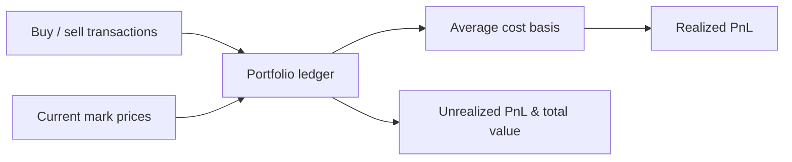

<p align="center">
  
</p>

<h1 align="center">Crypto Portfolio Tracker</h1>

<p align="center">
  <strong>Crypto portfolio PnL tracker with cost basis — average cost, realized & unrealized — in Python.</strong><br>
  Record buy/sell transactions per asset, track average cost basis, and mark to market.
</p>

<p align="center">
  <em>Built and maintained by <a href="https://viprasol.com">Viprasol Tech</a> — Fintech Experts. Full-Stack Builders.</em>
</p>

<p align="center">
  <a href="https://github.com/Viprasol-Tech/crypto-portfolio-tracker/actions/workflows/ci.yml"></a>
  <a href="LICENSE"></a>
  
  <a href="https://t.me/viprasol_help"></a>
  <a href="https://github.com/Viprasol-Tech/crypto-portfolio-tracker/stargazers"></a>
</p>

---

> ## ⚠️ Disclaimer
> This software is for **educational purposes only** and is **not financial advice**. Cryptocurrency markets are highly volatile and involve substantial risk, including the **total loss of capital**. PnL figures are accounting estimates only and may differ from your broker, exchange, or tax authority's calculations. Always verify against your own records. **Use at your own risk** — Viprasol Tech assumes no responsibility for your trading or tax decisions.

---

## ✨ Features

- 📒 **Per-asset transaction ledger** — record every buy and sell with optional fees.
- 📐 **Average cost basis** — running weighted-average cost maintained automatically.
- 💰 **Realized PnL** — booked on each sell (fee-aware), per asset and in total.
- 📈 **Unrealized PnL** — mark open positions to any set of current prices.
- 👜 **Holdings & valuation** — `holdings()` and `total_value(prices)` at a glance.
- 🖥️ **CLI** — `crypto-portfolio-tracker demo` records sample trades and prints a PnL table.
- ⚙️ **Modern tooling** — ruff, mypy (strict), pytest, GitHub Actions CI.

## 🚀 Quickstart

```bash
git clone https://github.com/Viprasol-Tech/crypto-portfolio-tracker.git
cd crypto-portfolio-tracker
python -m pip install -e ".[dev]"

# Record sample transactions and print a PnL summary:
crypto-portfolio-tracker demo
```

## 🧩 Track your own portfolio

```python
from crypto_portfolio_tracker.portfolio import Portfolio

pf = Portfolio()
pf.buy("BTC", 1.0, 20_000.0)
pf.buy("BTC", 1.0, 30_000.0)        # average cost basis -> 25,000

realized = pf.sell("BTC", 1.0, 40_000.0)   # realized PnL = 15,000
print(realized)

prices = {"BTC": 45_000.0}
print(pf.holdings())                 # {"BTC": 1.0}
print(pf.unrealized_pnl(prices))     # 20,000
print(pf.total_value(prices))        # 45,000
```

## 🏗️ Architecture



## 🗺️ Roadmap

- [x] Average cost basis with fee-aware realized PnL
- [x] Unrealized PnL, holdings, and total valuation
- [x] Typer CLI demo + strict typing and tests
- [ ] CSV / exchange-export import
- [ ] FIFO / LIFO lot accounting modes
- [ ] Time-weighted returns and tax-lot reports

## 🤝 Contributing

PRs welcome — see [CONTRIBUTING.md](CONTRIBUTING.md) and our [Code of Conduct](CODE_OF_CONDUCT.md).

## Contact — Viprasol Tech Private Limited

- Website: [viprasol.com](https://viprasol.com)
- Email: [support@viprasol.com](mailto:support@viprasol.com)
- Telegram: [t.me/viprasol_help](https://t.me/viprasol_help) | WhatsApp: +91 96336 52112
- GitHub: [@Viprasol-Tech](https://github.com/Viprasol-Tech) | [LinkedIn](https://www.linkedin.com/in/viprasol/) | X [@viprasol](https://twitter.com/viprasol)

> *Viprasol Tech — fintech software, algorithmic trading systems, MT4/MT5 bots, AI voice agents, and B2B SaaS. Need a custom build? [Get in touch](mailto:support@viprasol.com).*

## License

[MIT](LICENSE) (c) 2025 Viprasol Tech Private Limited
