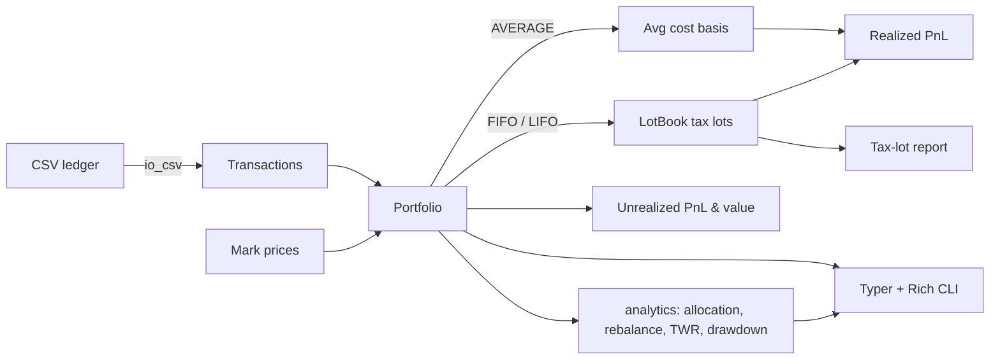

<p align="center">
  
</p>

<h1 align="center">Crypto Portfolio Tracker</h1>

<p align="center">
  <strong>Cost-basis accounting, tax-lot reports, allocation &amp; rebalancing, and performance analytics for your crypto portfolio — in pure Python.</strong><br>
  FIFO / LIFO / average cost basis · realized &amp; unrealized PnL · TWR &amp; drawdown · CSV import/export · a rich CLI.
</p>

<p align="center">
  <em>Built and maintained by <a href="https://viprasol.com">Viprasol Tech</a> — Fintech Experts. Full-Stack Builders.</em>
</p>

<p align="center">
  <a href="https://github.com/Viprasol-Tech/crypto-portfolio-tracker/actions/workflows/ci.yml"></a>
  <a href="LICENSE"></a>
  
  
  
  
  <a href="https://t.me/viprasol_help"></a>
  <a href="https://github.com/Viprasol-Tech/crypto-portfolio-tracker/stargazers"></a>
</p>

---

> ## ⚠️ Disclaimer
> This software is for **educational purposes only** and is **not financial or tax advice**. Cryptocurrency markets are highly volatile and involve substantial risk, including the **total loss of capital**. PnL and cost-basis figures are accounting estimates only and may differ from your broker, exchange, or tax authority's calculations. Tax-lot output is **not** a substitute for a qualified tax professional. Always verify against your own records. **Use at your own risk** — Viprasol Tech assumes no responsibility for your trading or tax decisions.

---

## ✨ Features

- 🧮 **Three cost-basis methods** — `AVERAGE`, `FIFO`, and `LIFO` lot matching from one API.
- 🧾 **Realized tax-lot report** — per-disposal proceeds, cost basis, gain/loss, holding period, and short/long-term classification.
- 💰 **Realized & unrealized PnL** — fee-aware, per asset and in total, marked to any price set.
- 🥧 **Allocation analysis** — current market-value weights per asset.
- ⚖️ **Rebalance suggestions** — concrete buy/sell notionals to reach a target allocation.
- 📈 **Performance metrics** — time-weighted return (cash-flow neutral) and max drawdown.
- 📥 **CSV import / export** — round-trippable ledger format, easy to edit in any spreadsheet.
- 🖥️ **Rich CLI** — `summary`, `taxlots`, `allocation`, `rebalance`, `performance`, `export-sample`, `demo`.
- ⚙️ **Modern tooling** — ruff, mypy (strict), 63 pytest cases, GitHub Actions CI. No network, no API keys.

## 🚀 Quickstart

```bash
git clone https://github.com/Viprasol-Tech/crypto-portfolio-tracker.git
cd crypto-portfolio-tracker
python -m pip install -e ".[dev]"

# 1) Write a sample ledger you can edit:
crypto-portfolio-tracker export-sample ledger.csv

# 2) See holdings + PnL under FIFO, marked to a price:
crypto-portfolio-tracker summary ledger.csv --method fifo --price BTC=45000

# 3) Realized tax-lot report (short vs long term):
crypto-portfolio-tracker taxlots ledger.csv --method fifo

# 4) Rebalance toward a 50/50 target:
crypto-portfolio-tracker rebalance ledger.csv -t BTC=0.5 -t ETH=0.5 -p BTC=45000 -p ETH=2000
```

## 🧩 Usage in code

```python
from datetime import datetime

from crypto_portfolio_tracker import CostBasisMethod, Portfolio
from crypto_portfolio_tracker.analytics import allocation, performance, rebalance

# Pick a cost-basis method (AVERAGE is the default).
pf = Portfolio(method=CostBasisMethod.FIFO)
pf.buy("BTC", 1.0, 20_000.0, timestamp=datetime(2023, 1, 1))
pf.buy("BTC", 1.0, 30_000.0, timestamp=datetime(2024, 3, 1))

realized = pf.sell("BTC", 1.0, 40_000.0, timestamp=datetime(2025, 6, 1))
print(realized)                       # 20,000 — FIFO consumes the 20k lot first

# Tax-lot report: one row per matched disposal.
for sale in pf.tax_lot_report():
    print(sale.asset, sale.gain, sale.holding_days, "long" if sale.long_term else "short")

pf.buy("ETH", 10.0, 1_500.0)
prices = {"BTC": 45_000.0, "ETH": 2_000.0}

print(allocation(pf, prices))                              # weights per asset
print(rebalance(pf, prices, {"BTC": 0.5, "ETH": 0.5}))     # trades to 50/50
print(performance([100.0, 120.0, 90.0, 110.0]))            # TWR + max drawdown
```

## 🏗️ Architecture



## 📚 API & CLI reference

| Area | Symbol / command | Purpose |
|------|------------------|---------|
| Core | `Portfolio(method=...)` | Ledger with `AVERAGE` / `FIFO` / `LIFO` accounting |
| Core | `Portfolio.from_transactions(txns, method)` | Replay a transaction list |
| Core | `Portfolio.tax_lot_report()` | List of realized `RealizedSale` disposals |
| Analytics | `allocation(pf, prices)` | Market-value weights per asset |
| Analytics | `rebalance(pf, prices, targets)` | Buy/sell notionals to a target allocation |
| Analytics | `time_weighted_return(values, flows)` | Cash-flow-neutral TWR |
| Analytics | `max_drawdown(values)` | Worst peak-to-trough decline |
| I/O | `load_transactions` / `save_transactions` | CSV ↔ `Transaction` |
| CLI | `summary` | Holdings + PnL for a CSV under a method |
| CLI | `taxlots` | Realized tax-lot report |
| CLI | `allocation` / `rebalance` | Weights and rebalance trades |
| CLI | `performance` | TWR + drawdown for an equity curve |
| CLI | `export-sample` / `demo` | Write a starter ledger / run a built-in demo |

## 🗺️ Roadmap

- [x] Average cost basis with fee-aware realized PnL
- [x] Unrealized PnL, holdings, and total valuation
- [x] FIFO / LIFO lot accounting modes
- [x] Realized tax-lot report with short/long-term classification
- [x] Allocation + rebalance suggestions
- [x] Time-weighted return and max drawdown
- [x] CSV import / export and CLI subcommands
- [ ] Specific-identification (HIFO) lot selection
- [ ] Multi-currency / fiat conversion
- [ ] Live price fetch adapters (opt-in)

## ❓ FAQ

**Which cost-basis method should I use?** FIFO is the common default for US crypto reporting; LIFO and average are offered for comparison and jurisdictions that allow them. Always confirm with a tax professional.

**Does it call any exchange or price API?** No. Everything runs locally on the CSV and prices you provide — no accounts, keys, or network access.

**Is the holding-period classification authoritative?** It flags >365 days as long-term as a convenience. It is an estimate, not tax advice.

**Can I script it without the CLI?** Yes — the `Portfolio`, `analytics`, and `io_csv` modules are a clean, fully typed library.

## 🤝 Contributing

PRs welcome — see [CONTRIBUTING.md](CONTRIBUTING.md) and our [Code of Conduct](CODE_OF_CONDUCT.md). Run `ruff check .`, `mypy src`, and `pytest` before opening a PR.

## Contact — Viprasol Tech Private Limited

- Website: [viprasol.com](https://viprasol.com)
- Email: [support@viprasol.com](mailto:support@viprasol.com)
- Telegram: [t.me/viprasol_help](https://t.me/viprasol_help) | WhatsApp: +91 96336 52112
- GitHub: [@Viprasol-Tech](https://github.com/Viprasol-Tech) | [LinkedIn](https://www.linkedin.com/in/viprasol/) | X [@viprasol](https://twitter.com/viprasol)

> *Viprasol Tech — fintech software, algorithmic trading systems, MT4/MT5 bots, AI voice agents, and B2B SaaS. Need a custom build? [Get in touch](mailto:support@viprasol.com).*

## License

[MIT](LICENSE) (c) 2025 Viprasol Tech Private Limited
